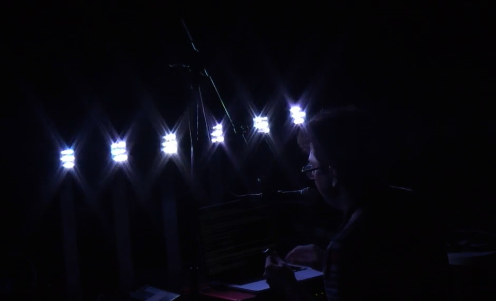

# kill-the-magic

 > I almost made a playlist for a dance party about 8 years back; this dance party I was going to call "Kill the Magic," where I would play a Daft Punk song, and then play the song that Daft Punk sampled directly after. I wanted to dispel the magic behind the litany of Daft Punk songs that acquired their magic from other musicians. But looking back, I don't think I would've accomplished anything.

 > I mean, how much do you really care that the groove from 'Harder, Better, Faster, Strong' is sampled from Edwin Birdsong's 'Cola Bottle Baby'?

 > I was talking to a good friend last night, and she mentioned (I'm paraphrasing badly) that "magic exists when there is no magic to begin with." Or was it more something like "even though we know that there is no magic occurring, that doesn't mean it's not magical."

 > So I'm going to take that to the extreme with this performance, with a sort of theatrical Bladerunner narration (as opposed to the narration-less director's cut, which is empirically better). I might even flip a coin to see which version I perform. I might play a song by The Crystals at the end of it, who knows?

 > - April 27, 2016
